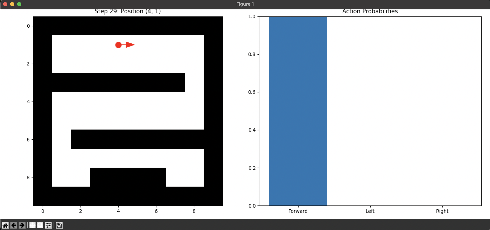

# 🧠 NeuroMap: LSTM-Based Maze Navigation Simulation

**NeuroMap** is a brain-inspired machine learning simulation where a virtual robot navigates a 2D maze using **LSTM (Long Short-Term Memory)** — a type of recurrent neural network designed to mimic human memory.  

This project demonstrates how robots can learn from **sequential experience** and make decisions based on past observations, just like humans navigate unfamiliar environments.

---

## 🎯 Project Objective

To build a fully Python-based simulation that combines:
- 🧠 **Neural memory (LSTM)** to recall past movements
- 🧭 **Path planning** in a maze-like environment
- 🎓 **Reinforcement-inspired training** for decision making

This project is ideal for **ML + Robotics internships**, showcasing skills in:
- Deep learning (LSTM)
- Simulation and visualization
- Intelligent agents
- Python-based architecture (no ROS/hardware required)

---
<p align="center">
  
</p>

## 🧠 What is LSTM?

**LSTM (Long Short-Term Memory)** is a type of Recurrent Neural Network (RNN) that can remember patterns over time. Unlike traditional neural networks, LSTMs are designed to **retain memory of previous inputs**, making them ideal for tasks where context matters — like speech, text, or **robot navigation**.

In this simulation:
- Each time step, the robot observes its local surroundings.
- The **LSTM model remembers previous moves and maze observations**.
- Based on that memory, it decides the next move toward the goal.
  
This is similar to how humans remember which paths are blocked and which lead to the goal.

---

## 🕹️ Project Components

```bash
LSTM_maze/
├── maze.py             # Maze generation logic (grid with walls, start, end)
├── model.py            # Defines the LSTM neural network
├── train.py            # Simulates training over episodes
├── visualize.py        # GUI to visualize robot path through the maze
├── neuromap_model.pth  # Trained model weights (can be reused)
└── README.md           # This file
